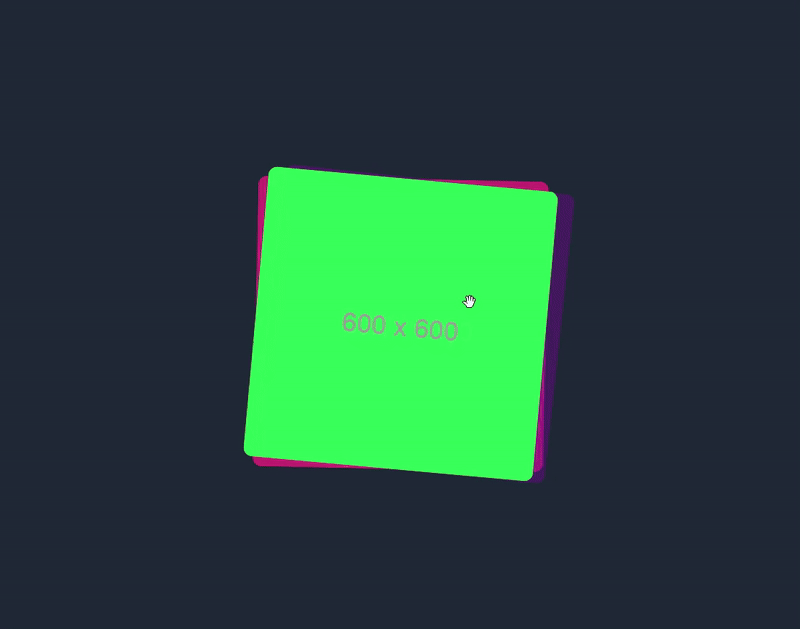

# Image Slider Carousel (Next.js, TailwindCSS, Framer Motion)

This project is a customizable image slider carousel built using **Next.js**, **TailwindCSS**, and **Framer Motion** for smooth animations. It provides a clean, responsive slider with intuitive transitions, supporting both manual and automatic sliding.

## Features

- **Smooth Animations**: Uses Framer Motion for smooth and easy-to-configure animations.
- **Responsive**: Fully responsive design with TailwindCSS.
- **Autoplay**: Option to automatically cycle through images.
- **Customizable**: Easily tweak styles and configurations.
- **Touch Support**: Works well on mobile devices with swipe support.

## Demo

## Installation

Follow the steps below to integrate the image slider into your Next.js project.
